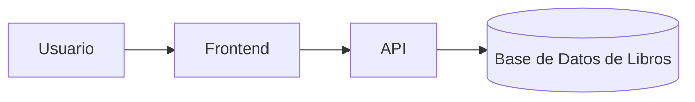

# App Biblioteca


Una app que sirve como una biblioteca virtual a disposición de la mano del usuario.

## Tabla de contenidos

- [Descripción](#descripción)
- [Instalación](#instalación)
- [Uso](#uso)
- [Estado de funcionalidades](#estado-de-funcionalidades)
- [Pendientes](#pendientes)
- [Arquitectura](#arquitectura)
- [Contribuidores](#contribuidores)

## Descripción

Este proyecto digitaliza los procesos tradicionales de una biblioteca física, ofreciendo un catálogo, un sisitema de reservas de libros y un formulario para el registro de nuevos usuarios.

## Instalación

Para clonar el repositorio e instalar todo lo necesario en tu entorno local, ejecuta los siguientes comandos en tu terminal:

```bash
git clone https://github.com/TU-USUARIO/laboratorio-readme.git
cd laboratorio-readme
npm install
```

## Uso

Una vez completada la instalación, puedes iniciar la aplicación del servidor local ejecutando el comando de arranque:

```bash
npm start
```

## Estado de funcionalidades

| Función  | Estado      | Descripción                                    |
| -------- | ----------- | ---------------------------------------------- |
| Catalogo | Listo       | Búsqueda por título, autor y categoríagin      |
| Registro | Listo       | Formulario para el registro de nuevos usuarios |
| Reserva  | En progreso | Sistema automatico para la reserva de libros   |

## Pendientes

- [x] Diseño de la base de datos de los libros y usuarios.
- [x] Crear la interfaz de búsqueda.
- [ ] Implementar el sistema de reserva automatico.

## Arquitectura



## Contribuidores

**[Jim Franco Parari Milla]** - _Desarrollador Principal_ - [jim-prueba](https://github.com/)
